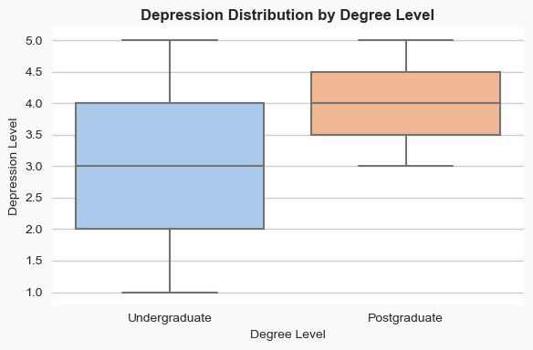
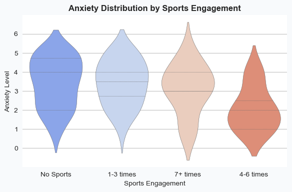
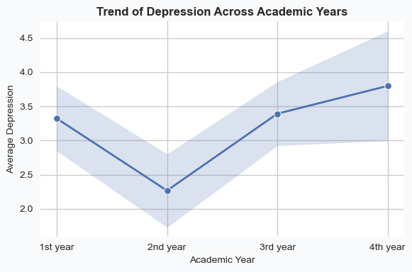
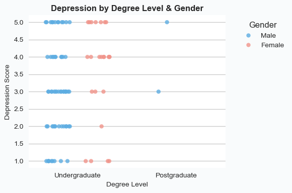
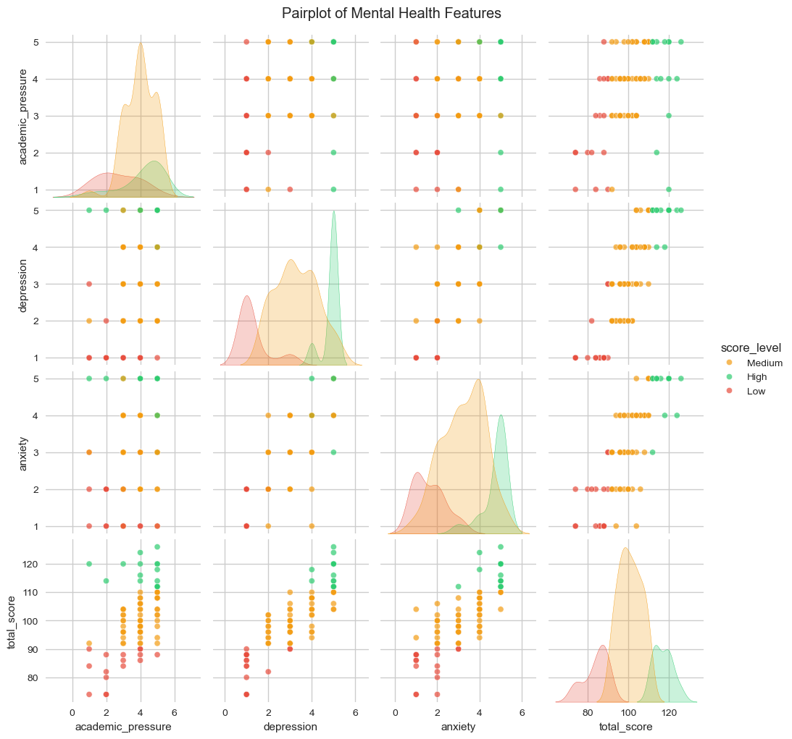
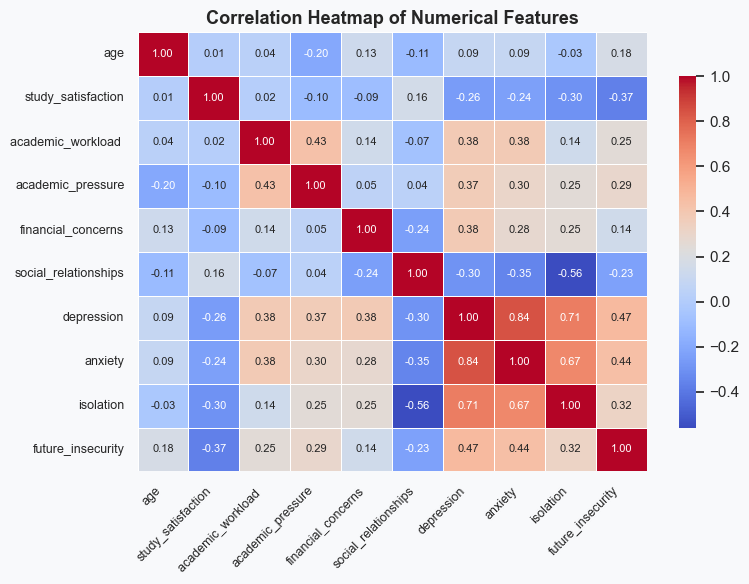

# 📊 Student Mental Health Analysis (EDA)

## 🧠 Overview

This project explores student mental health using Exploratory Data Analysis (EDA). It focuses on understanding how academic pressure, lifestyle habits, and social factors impact mental health conditions such as depression and anxiety.

## ❗ Problem Statement

Students face increasing academic stress, competition, and lifestyle challenges which negatively affect their mental health.

This project aims to identify:

* Key factors influencing depression and anxiety
* The impact of academic pressure on students
* The role of lifestyle habits (like sports) on mental well-being

## 🎯 Objectives

* Perform detailed Exploratory Data Analysis (EDA)
* Identify relationships between mental health indicators
* Detect patterns and trends in student behavior
* Find key contributing factors to mental health issues
* Provide actionable insights

## 🛠️ Tech Stack

* Python 🐍
* Pandas 📊
* NumPy 🔢
* Matplotlib 📉
* Seaborn 🎨
* Jupyter Notebook 📓
* ydata-profiling 🤖

## 📈 Visualizations

### 🔹 Bar Plot – Average Depression by Degree Level

### 🔹 Box Plot – Depression Distribution

### 🔹 Violin Plot – Anxiety vs Sports Engagement

### 🔹 Line Plot – Depression Trend Across Academic Years

### 🔹 Strip Plot – Depression by Degree & Gender

### 🔹 Pair Plot – Feature Relationships

### 🔹 Correlation Heatmap

## 🔍 Key Insights

* 📌 Higher academic pressure leads to increased depression
* 📌 Students with low sports engagement show higher anxiety
* 📌 Strong correlation between anxiety and depression
* 📌 Postgraduate students show slightly higher stress levels
* 📌 Lifestyle plays a major role in mental health

## 💡 Recommendations

* 🏃 Encourage regular physical activities
* 📅 Improve academic scheduling to reduce pressure
* 🧑‍⚕️ Provide mental health counseling support
* ⚖️ Promote work-life balance for students
* 📢 Increase mental health awareness programs

## 🚀 Future Scope

* Apply Machine Learning models for prediction
* Build a mental health prediction system
* Deploy as a web application

## 📂 Project Structure

* `EDA_Final_Project.ipynb`
* `images/` (all visualization files)
* `EDA_Report.html`
* `Student_Mental_Health_Analysis.pdf`

## ✨ Conclusion

This project demonstrates how data analysis can be used to understand student mental health and identify key factors affecting well-being. The insights can help institutions take better decisions to support students.

## 👩‍💻 Author

**Suhani Patra**
